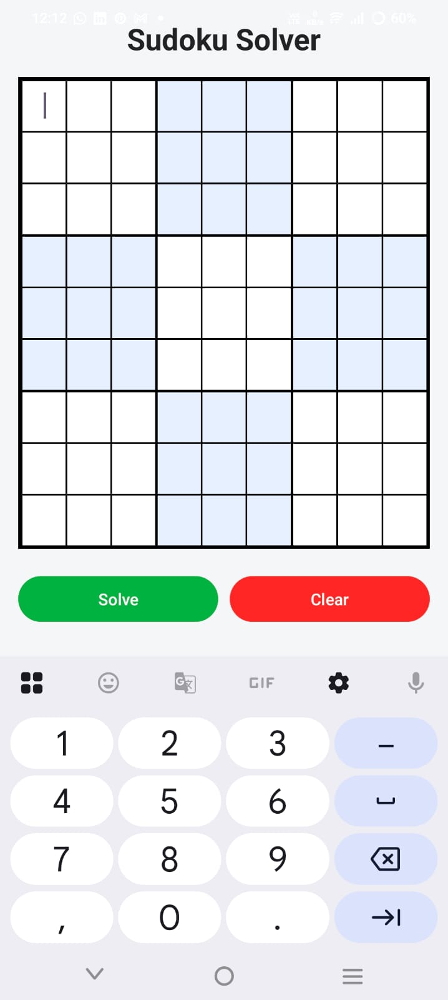
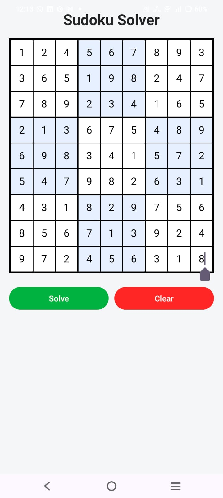

# Sudoku Solver Android App

A *Sudoku Solver app* built with *Java* in *Android Studio*.  
Automatically solves Sudoku puzzles using the *backtracking algorithm* with a clean and modern UI.

---

## Features

- Solve any Sudoku puzzle instantly
- 9×9 grid with *highlighted 3×3 boxes*
- Dark and readable numbers inside cells
- Solve & Clear buttons for easy interaction
- Beginner-friendly and lightweight

---

## Screenshots

*Empty Grid:*  


*Solved Puzzle:*  



---

## How It Works

1. Enter numbers in the 9×9 Sudoku grid
2. Press *Solve* → the app fills missing numbers automatically
3. Press *Clear* → to start a new puzzle

---

## Technology Used

- *Language:* Java
- *IDE:* Android Studio
- *Algorithm:* Backtracking
- *UI:* Android XML layouts

---

## How to Run

1. Clone this repository:
```bash
git clone https://github.com/anamshaikh-dev/Sudoku_Solver.git